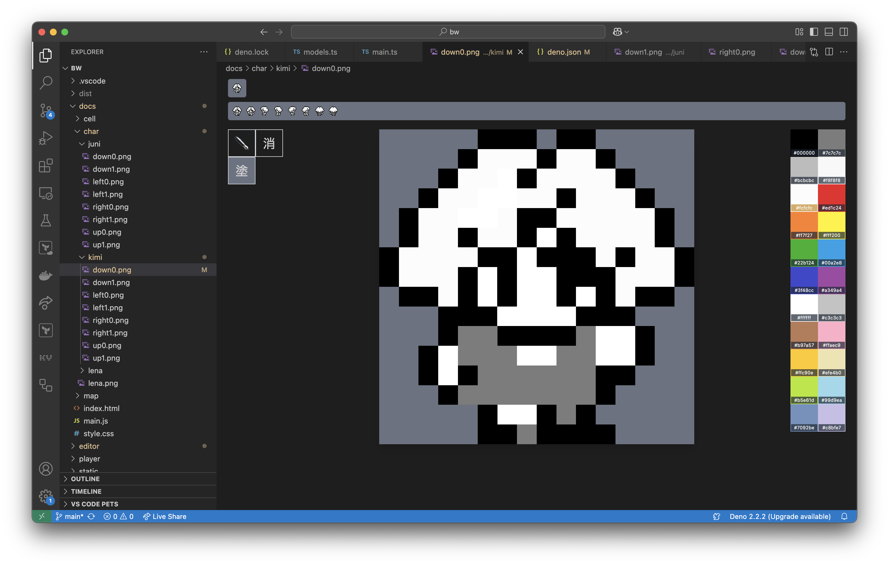
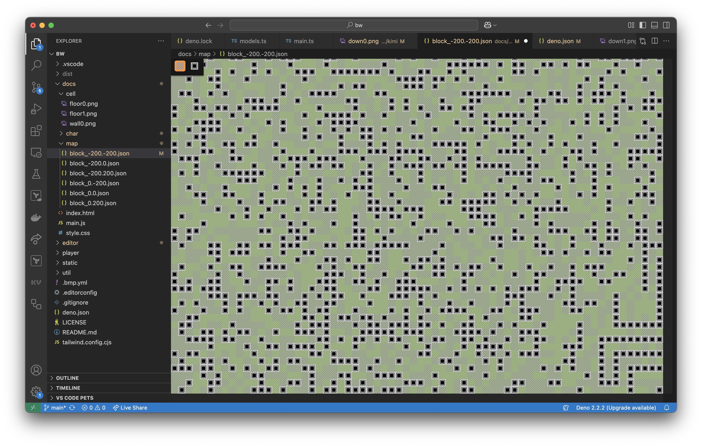
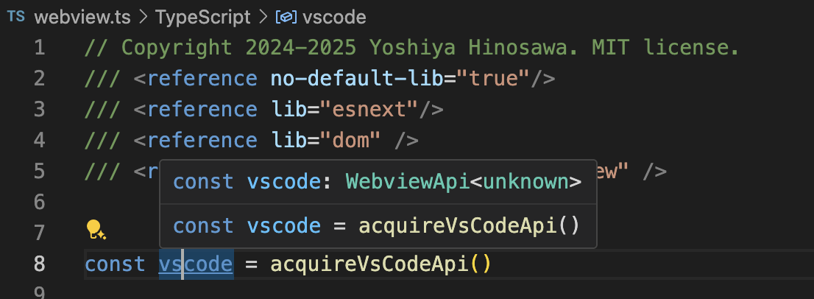
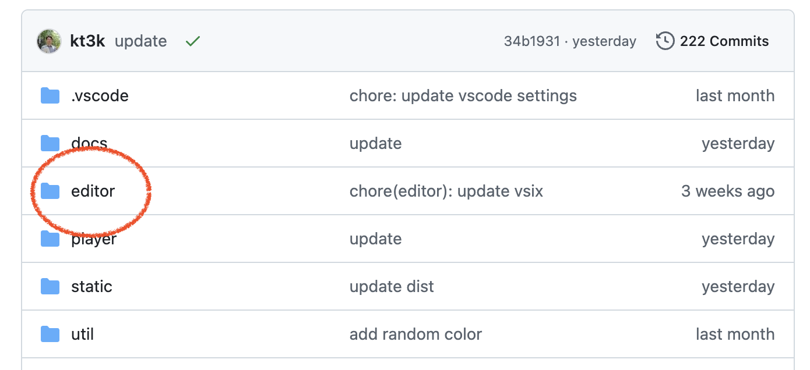

class: middle center

 

## VSCode Extension を<br/>Deno で作ってみた

---

## Yoshiya Hinosawa


- x.com / github - @kt3k
- Web エンジニア
- Deno Land 社メンバー (2021 ~)

---
class: center

[デモ](https://kt3k.github.io/bw/) (ゲーム)


---
Extension 1 (ピクセルエディター)



---
Extension 2 (マップエディター)



---

## 目的

Deno の DX で VSCode Extension を開発したい

--
- Deno で型チェック
- Deno でビルド
- Deno でリント
- Deno でフォーマット

したい

---

## レシピ

- `esbuild-deno-loader`
- `@ts-types`

---

## esbuild-deno-loader

- Deno のバンドラー
- Deno のモジュール解決ルールで書いたコードを<br/>バンドルして1ファイルに出来る

--
```js
import "jsr:@std/path@1";
import "npm:react@19.0.0";
import "https://deno.land/x/jose@v6.0.8";
```

例えば、上のような import をバンドル可能

---

## VSCode Extension 用ビルド

```js
import * as esbuild from "npm:esbuild@0.24";
import { denoPlugins } from "jsr:@luca/esbuild-deno-loader@0.11";
import { resolve } from "jsr:@std/path@1";

const result = await esbuild.build({
  plugins: [...denoPlugins({
    configPath: resolve("path/to/deno.json")
  })],
  entryPoints: ["extension.ts"],
  outfile: "extension.js",
  bundle: true,
  external: ["vscode"],
  format: "cjs",
});
esbuild.stop();
```

---

## ビルドのポイント 1

```js
import * as vscode from "vscode";
```

をどう解決するか?

--
```js
  external: ["vscode"]
```

で、"vscode" のインポートがバンドルされなくなる <br/>
--
=> 実行時に "vscode" が import される<br/>
--
=> 動く!

---

## ビルドのポイント 2

VSCode は CommonJS しか読めない

--
```js
  format: "cjs"
```

の指定で、出力形式が CommonJS になる。

---

## VSCode Extension 用ビルド (再掲)

```js
import * as esbuild from "npm:esbuild@0.24";
import { denoPlugins } from "jsr:@luca/esbuild-deno-loader@0.11";
import { resolve } from "jsr:@std/path@1";

const result = await esbuild.build({
  plugins: [...denoPlugins({
    configPath: resolve("path/to/deno.json")
  })],
  entryPoints: ["extension.ts"],
  outfile: "extension.js",
  bundle: true,
  external: ["vscode"],
  format: "cjs",
});
esbuild.stop();
```

---
class: middle center inverse

ちなみに

---
## @kt3k/pack

esbuild と esbuild-deno-loader のラッパー CLI

--
```sh
deno -A jsr:@kt3k/pack input.ts
```

で、Deno 向けのソースコードをバンドルできる。

---
## @kt3k/pack

VSCode Extension のビルドは

--
```sh
deno -A jsr:@kt3k/pack extension.ts \
  -o extension.js --external vscode --format cjs
```

と、簡潔に書けます

---
class: middle center inverse

## Deno で型をつける

---

## 型チェックのポイント

```js
import * as vscode from "vscode";
```

=> モジュール解決エラー

---

## 型チェックのポイント

```js
import * as vscode from "vscode";
```

にどうやって型をつけるか?

--
<br/>=> `@ts-types` ディレクティブを使う

---

## 型チェックのポイント

```js
// @ts-types="npm:@types/vscode"
import * as vscode from "vscode";
```

--
@ts-types を指定すると、本来の解決ルールと関係なく、指定された型定義ファイルで型が上書きされる

---
class: middle center inverse

Extension のメインの型はそれで良いとして<br/>
Webview側は?

---

## 型チェックのポイント

Webviewの型付け

ファイルの先頭にこれを書けば OK

```js
/// <reference no-default-lib="true"/>
/// <reference lib="esnext"/>
/// <reference lib="dom" />
/// <reference types="@types/vscode-webview" />
```

---

## 型チェックのポイント

```js
/// <reference no-default-lib="true"/>
```

型を全てリセットする(消す)

---

## 型チェックのポイント

```js
/// <reference lib="esnext"/>
/// <reference lib="dom" />
```

JS と DOM (ブラウザ) の型を入れる

---

## 型チェックのポイント

```js
/// <reference types="@types/vscode-webview" />
```

@types/vscode-webview<br/>(VSCode の Webview の型が入ってるパッケージ)

---

## 型チェックのポイント

Webviewの型付け




---

## その他

- リント - deno lint で OK
- フォーマット - deno fmt で OK

---
## まとめ

Deno で VSCode Extension 開発は

- Deno で型チェックできる
- Deno でビルドできる
- Deno でリントできる
- Deno でフォーマットできる


---
class: middle center inverse

Deno の DX で十分に VSCode Extension 開発が可能

---
class: middle center

サンプルレポジトリ

[github.com/kt3k/bw](https://github.com/kt3k/bw)





ご清聴ありがとうございました 🙇‍♂️